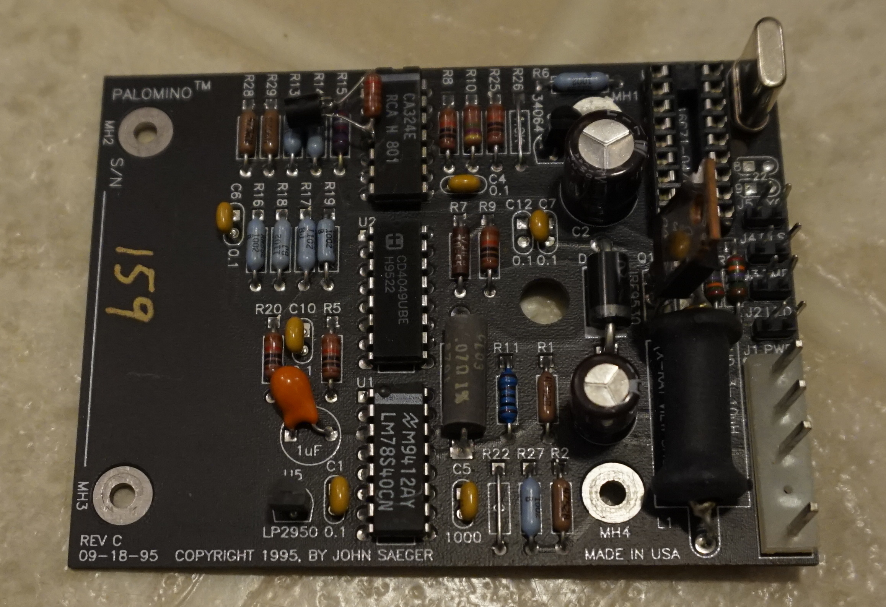

## palomino
The palomino battery charger.

  

This was a rapid battery charger for police and other emergency radio batteries. These days, up to a point, rapid charging of rechargeable batteries is fairly common. In the late 1990s, not so much.

A highlight of the design is that one of the test cases is that it should be able to charge a battery with a shorted cell without overheating. These kinds of emergency workers are not always in a position to go get a new battery, so I felt like it was a good idea to make the most of what they had. Charge termination was based on the derivative of the voltage.

The pc board design along with the [design compiler](https://github.com/aequorea/dc) file is in the /revb directory.
The gerber files for plotting the pc board layout is in the /gerber directory.
The firmware CHARGERF.ASM is in the /sw directory. It is in PIC16C71 assembly language. I suppose you could find an assembler on the microchip web site. I've provided an object file suitable for programming a device.
